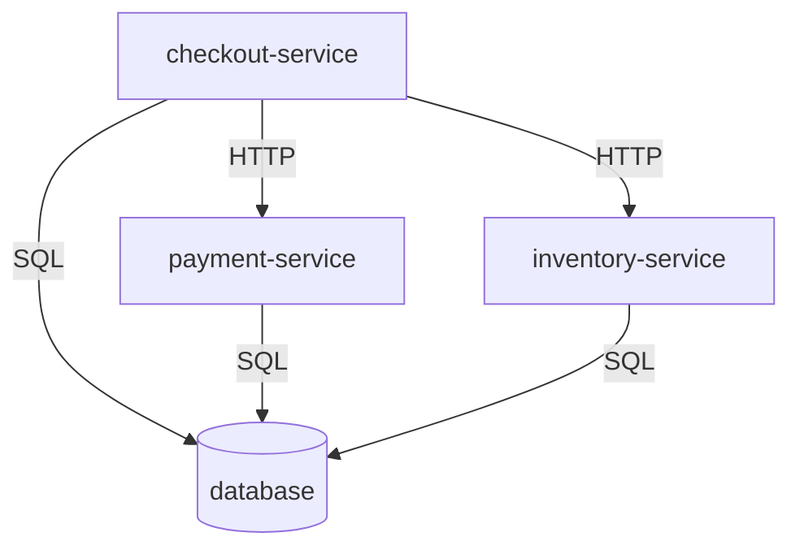

# Signal Trace

Signal Trace is an evidence-grounded AI incident investigation agent project. Part 1 provides its initial synthetic production environment: static, deterministic evidence for **Use Case 1: deployment-related 5xx spike**. No AI agent, running microservices, network services, or additional incident scenarios are implemented.

## Architecture

```text
.
├── environment/
│   ├── services/
│   │   ├── checkout-service.json
│   │   ├── payment-service.json
│   │   ├── inventory-service.json
│   │   └── database.json
│   └── topology.json
├── scenarios/uc1_deployment_5xx/
│   ├── incident.json
│   ├── logs.jsonl
│   ├── metrics.jsonl
│   └── deployments.jsonl
├── runbooks/deployment_5xx.json
├── evaluation/uc1_deployment_5xx.json
├── schemas/
│   ├── service.schema.json
│   ├── topology.schema.json
│   ├── log.schema.json
│   ├── metric.schema.json
│   ├── deployment.schema.json
│   ├── runbook.schema.json
│   ├── incident.schema.json
│   └── ground_truth.schema.json
├── signal_trace/
│   ├── __init__.py
│   └── validation.py
├── tests/test_environment.py
├── prompts/build_synthetic_environment.md
├── .gitignore
├── pyproject.toml
└── README.md
```

Service definitions and topology describe the shared environment. Each scenario owns its observation window, alert, logs, metrics, and deployment history. Runbooks contain reusable investigation guidance. Evaluation answers are isolated under `evaluation/`; future agent evidence tools should read only `environment/`, `scenarios/`, and `runbooks/` and never expose evaluation answers. The validator intentionally reads both evidence and evaluation data.

Each JSON object or JSONL record uses `schema_version: "1.0"`. Strict JSON Schema contracts define required fields and types. Stable service IDs join the datasets; unique log, metric, deployment, incident, and runbook IDs support evidence citations. Use globally unique record IDs when adding scenarios. Additional scenarios can use sibling directories under `scenarios/` and matching evaluation files without reorganizing existing data. New evidence types or contract changes require explicit schema/validator updates.

## Service topology



Edges point from caller to dependency. All four services are synthetic data definitions. The database is represented by topology and health logs rather than an HTTP metric series.

## Use Case 1

The observation period is January 15, 2026, 10:00–10:15 UTC (end exclusive).

| Time (UTC) | Event |
| --- | --- |
| 10:00–10:05 | Checkout v2.3.0 baseline: 0.1% 5xx |
| 10:05 | Successful checkout-service deployment to v2.3.1 |
| 10:06:15 | First sampled `java.lang.NullPointerException` in checkout discount handling |
| 10:06–10:15 | Checkout metric windows show 18% 5xx; downstream services stay healthy |
| 10:09 | Alert fires after three completed one-minute windows above 5% |

Evaluation ground truth: **checkout-service deployment regression**, affected service **checkout-service**, severity **SEV-2**. The faulty null handling is an injected scenario assumption supported by the deployment, exception, and metric timeline. SEV-2 is a supplied evaluation label, not a computed organization-wide severity policy.

## Evidence semantics and future tools

| Future tool | Data and useful filters |
| --- | --- |
| `search_logs()` | Scenario logs: timestamp, service_id, level, exception_type, version, message; trace_id correlates sampled observations |
| `get_metrics()` | Scenario metrics: service_id, name, timestamp; request/error counts, error rate, and p95 latency |
| `get_recent_deployments()` | Scenario deployment history: timestamp, service_id, versions, status |
| `get_dependencies()` | Shared directed topology edges and service definitions |
| `search_runbooks()` | Runbook title, tags, service_ids, symptoms, and investigation steps |

These are design targets; tool handlers are not implemented. Future queries should select scenario scope explicitly and use start-inclusive/end-exclusive time intervals.

Metric timestamps mark the start of fixed, non-overlapping 60-second windows. Rates are fractions (0.18 means 18%) and equal error counts divided by request counts; a zero-request window has rate zero. Latency is milliseconds. Logs are sampled observations, not an exhaustive request ledger, so log counts do not equal metric counts. A shared trace ID groups the minute's synthetic workflow observations; records are not spans or an exact causal call sequence. Database HTTP status is null. All timestamps use UTC; historic deployments can precede the observation interval.

Assumptions: rollout is instantaneous and successful; the regression first manifests a minute later; each application has 1,000 requests per minute; baseline errors are background noise; payment, inventory, and database remain healthy. No recovery or rollback is simulated. Fixtures are authored and committed directly, so no random seed, generator, credentials, or external infrastructure is needed.

## Validate and test

From the repository root with Python 3.10+:

```bash
python3 -m venv .venv
source .venv/bin/activate
python3 -m pip install -e .
python3 -m signal_trace.validation
python3 -m unittest discover -s tests -v
```

Validation checks schemas, timestamp formats, IDs, service/evidence references, metric arithmetic, observation boundaries, and completed alert windows. Tests verify the deployment-regression timeline and deliberately corrupt fixtures to exercise validation failures. The CLI also accepts `--root /path/to/repository`; fixtures stay in the repository rather than being packaged as Python resources.

## AI-assisted development specifications

`prompts/` stores concise, reusable implementation specifications. `build_synthetic_environment.md` records the Part 1 request and its scope constraints. Routine debugging conversations are not stored here.
