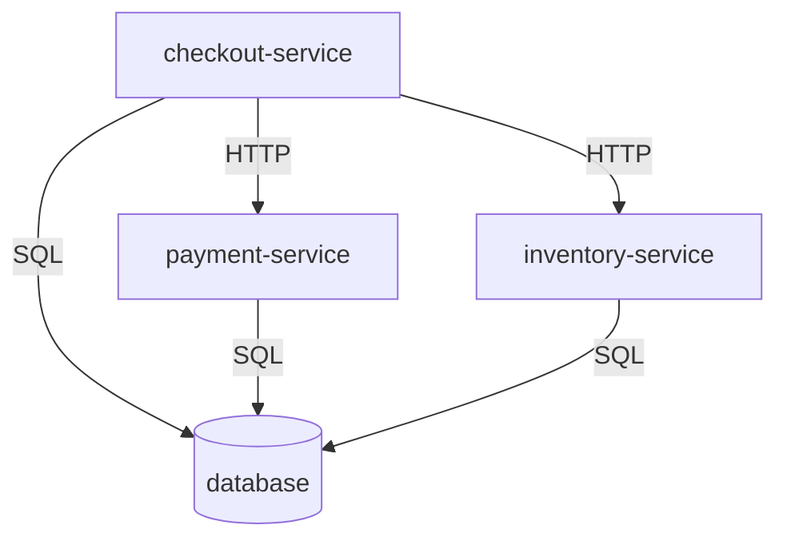

# Signal Trace

Signal Trace is an evidence-grounded AI incident investigation agent project. Part 1 provides its initial synthetic production environment: static, deterministic evidence for **Use Case 1: deployment-related 5xx spike**. Part 2 adds a FastAPI backend that validates and acknowledges incident requests. Part 3 adds read-only tools over the existing operational fixtures. No AI agent, simulated running microservices, or additional incident scenarios are implemented.

## Architecture

```text
.
├── environment/
│   ├── services/
│   │   ├── checkout-service.json
│   │   ├── payment-service.json
│   │   ├── inventory-service.json
│   │   └── database.json
│   └── topology.json
├── scenarios/uc1_deployment_5xx/
│   ├── incident.json
│   ├── logs.jsonl
│   ├── metrics.jsonl
│   └── deployments.jsonl
├── runbooks/deployment_5xx.json
├── evaluation/uc1_deployment_5xx.json
├── schemas/
│   ├── service.schema.json
│   ├── topology.schema.json
│   ├── log.schema.json
│   ├── metric.schema.json
│   ├── deployment.schema.json
│   ├── runbook.schema.json
│   ├── incident.schema.json
│   └── ground_truth.schema.json
├── signal_trace/
│   ├── __init__.py
│   ├── validation.py
│   ├── main.py              # compatibility entry point
│   ├── config.py
│   ├── api/                 # app.py entry point, health and incident routes
│   ├── models/              # request, acknowledgement, future triage contracts
│   └── tools/               # typed contracts, queries, synthetic source adapter
├── tests/
│   ├── test_environment.py
│   ├── test_backend.py
│   └── test_tools.py
├── prompts/
│   ├── build_synthetic_environment.md
│   ├── build_backend_skeleton.md
│   └── build_tool_layer.md
├── .gitignore
├── pyproject.toml
└── README.md
```

Service definitions and topology describe the shared environment. Each scenario owns its observation window, alert, logs, metrics, and deployment history. Runbooks contain reusable investigation guidance. Evaluation answers are isolated under `evaluation/`; future agent evidence tools should read only `environment/`, `scenarios/`, and `runbooks/` and never expose evaluation answers. The validator intentionally reads both evidence and evaluation data.

Each JSON object or JSONL record uses `schema_version: "1.0"`. Strict JSON Schema contracts define required fields and types. Stable service IDs join the datasets; unique log, metric, deployment, incident, and runbook IDs support evidence citations. Use globally unique record IDs when adding scenarios. Additional scenarios can use sibling directories under `scenarios/` and matching evaluation files without reorganizing existing data. New evidence types or contract changes require explicit schema/validator updates.

## Service topology



Edges point from caller to dependency. All four services are synthetic data definitions. The database is represented by topology and health logs rather than an HTTP metric series.

## Use Case 1

The observation period is January 15, 2026, 10:00–10:15 UTC (end exclusive).

| Time (UTC) | Event |
| --- | --- |
| 10:00–10:05 | Checkout v2.3.0 baseline: 0.1% 5xx |
| 10:05 | Successful checkout-service deployment to v2.3.1 |
| 10:06:15 | First sampled `java.lang.NullPointerException` in checkout discount handling |
| 10:06–10:15 | Checkout metric windows show 18% 5xx; downstream services stay healthy |
| 10:09 | Alert fires after three completed one-minute windows above 5% |

Evaluation ground truth: **checkout-service deployment regression**, affected service **checkout-service**, severity **SEV-2**. The faulty null handling is an injected scenario assumption supported by the deployment, exception, and metric timeline. SEV-2 is a supplied evaluation label, not a computed organization-wide severity policy.

## Evidence semantics and tools

| Tool | Data and useful filters |
| --- | --- |
| `search_logs()` | Scenario logs: service, time range, level, message keyword; trace_id correlates sampled observations |
| `get_metrics()` | Scenario metrics: service, metric name, time range; request/error counts, error rate, and p95 latency |
| `get_recent_deployments()` | Scenario deployment history: timestamp, service_id, versions, status |
| `get_dependencies()` | Shared directed topology edges and service definitions |
| `search_runbooks()` | Runbook title, tags, service_ids, symptoms, and investigation steps |

The Part 3 tools below query only Use Case 1. Time ranges are start-inclusive and end-exclusive.

Metric timestamps mark the start of fixed, non-overlapping 60-second windows. Rates are fractions (0.18 means 18%) and equal error counts divided by request counts; a zero-request window has rate zero. Latency is milliseconds. Logs are sampled observations, not an exhaustive request ledger, so log counts do not equal metric counts. A shared trace ID groups the minute's synthetic workflow observations; records are not spans or an exact causal call sequence. Database HTTP status is null. All timestamps use UTC; historic deployments can precede the observation interval.

Assumptions: rollout is instantaneous and successful; the regression first manifests a minute later; each application has 1,000 requests per minute; baseline errors are background noise; payment, inventory, and database remain healthy. No recovery or rollback is simulated. Fixtures are authored and committed directly, so no random seed, generator, credentials, or external infrastructure is needed.

## Run the backend

From the repository root, create and activate a virtual environment, then install and run:

```bash
python3 -m venv .venv
source .venv/bin/activate
python3 -m pip install -e ".[test]"
python3 -m uvicorn signal_trace.api.app:app --reload
```

The service runs at `http://127.0.0.1:8000`; interactive API documentation is at `/docs`.
`GET /health` returns HTTP 200 with `{"status":"ok"}`. Submit the existing incident fixture:

```bash
curl -X POST http://127.0.0.1:8000/incidents \
  -H 'Content-Type: application/json' \
  --data-binary @scenarios/uc1_deployment_5xx/incident.json
```

`POST /incidents` returns HTTP 200 with `incident_id`, `status: "accepted"`, and
`message: "Incident accepted. Triage is not implemented."` Invalid requests return
HTTP 422. Acceptance is stateless: nothing is persisted, queued, or investigated.

`api/app.py` assembles the application through `create_app()`, `api/` contains routes,
and `models/` contains strict Pydantic contracts. The request mirrors the Part 1
incident schema, reuses its UTC timestamp validator, and checks the observation/alert
interval. Evidence consistency, known service IDs, and alert metric windows remain
in the existing offline validator; the API does not read evidence or evaluation files.
`models/responses.py` defines a future `TriageResponse` with summary, optional cause,
affected service and severity, and evidence IDs. It is a model only, available as
JSON Schema through `TriageResponse.model_json_schema()`.

The original `signal_trace.main:app` entry point remains available for compatibility.

`config.py` loads service settings from environment variables; set
`SIGNAL_TRACE_APP_NAME` to override the API title (default: `Signal Trace`).
The backend still only acknowledges incidents. The Tool Layer is a separate Python interface; orchestration, LLM calls, RAG, and hypothesis generation are not implemented.

## Tool Layer

Import the five functions from `signal_trace.tools`, or instantiate `ToolLayer(source=...)`
with an `OperationalSource` adapter. `tools/models.py` defines strict Pydantic input/output
contracts, `service.py` handles deterministic queries, and `source.py` hides fixture paths
and normalizes data. The default `SyntheticSource` reads only the existing shared environment,
runbooks, and Use Case 1 operational evidence; it uses the existing schemas and UTC validator
without loading evaluation answers or repeating offline cross-record validation.

| Tool | Contract |
| --- | --- |
| `search_logs(service, start_time, end_time, level=None, keyword=None)` | Returns `list[LogRecord]`: timestamp, service, level, message, optional trace ID, and log ID. Level is an exact uppercase filter; keyword is a case-insensitive message substring. |
| `get_metrics(service, start_time, end_time, metric_name=None)` | Returns `list[MetricRecord]`: timestamp, service, metric name, numeric value, unit, window length, and evidence ID. |
| `get_recent_deployments(service, since)` | Returns `list[DeploymentRecord]` since the inclusive timestamp, newest first: service, deployed version, timestamp, deployment ID, and metadata (previous version, status, environment). |
| `get_dependencies(service)` | Returns `Dependencies` with sorted direct downstream/upstream service names and `service_known`. No transitive traversal. |
| `search_runbooks(query, service=None)` | Returns `list[RunbookRecord]` with title, applicable services, tags, symptoms, full steps, ID, and stable `runbook:<id>` reference. All case-insensitive query word tokens must occur in the title, tags, symptoms, or steps. Results are sorted by ID. |

Metrics expose `request_count` (requests), `error_5xx_count` (requests), `error_5xx_rate`
(fraction), and `latency_p95_ms` (ms). Omit `metric_name` or pass `None` to retrieve
all four. A supplied name matches only that specific metric; unmatched names return an empty list. Each measurement retains its original metric evidence
ID and 60-second window. Filtering uses the window's start timestamp. Logs and metrics are
sorted chronologically with stable tie-breakers.

Pass timezone-aware Python `datetime` values; offsets normalize to UTC. Reversed ranges,
naive datetimes, blank strings, incorrect types, and invalid log levels raise Pydantic
`ValidationError`. Equal range endpoints return no records. Supported levels are `DEBUG`,
`INFO`, `WARNING`, `ERROR`, and `CRITICAL`; current fixtures contain only `INFO` and `ERROR`.
Service IDs match exactly. Unknown services return empty lists, or empty dependencies with
`service_known=False`; unmatched metrics and queries also return empty lists. Missing or
invalid source data raises `ToolDataError`, rather than appearing as a successful empty query.

```python
from datetime import datetime, timezone
from signal_trace.tools import search_logs

errors = search_logs(
    service="checkout-service",
    start_time=datetime(2026, 1, 15, 10, 0, tzinfo=timezone.utc),
    end_time=datetime(2026, 1, 15, 10, 15, tzinfo=timezone.utc),
    level="ERROR",
    keyword="discount",
)
# Serialize any returned model with .model_dump(mode="json").
```

These tools do not write data, execute runbook steps, or invoke the agent. No Part 4
implementation is included.

## Validate and test

From the repository root with Python 3.10+:

```bash
python3 -m venv .venv
source .venv/bin/activate
python3 -m pip install -e ".[test]"
python3 -m signal_trace.validation
python3 -m unittest discover -s tests -v
```

Validation checks schemas, timestamp formats, IDs, service/evidence references, metric arithmetic, observation boundaries, and completed alert windows. Tests verify the deployment-regression timeline and deliberately corrupt fixtures to exercise validation failures. The CLI also accepts `--root /path/to/repository`; fixtures stay in the repository rather than being packaged as Python resources.

## AI-assisted development specifications

`prompts/` stores concise, reusable implementation specifications. `build_synthetic_environment.md` records the Part 1 request and its scope constraints. `build_backend_skeleton.md` records the Part 2 backend scope. `build_tool_layer.md` records the Part 3 specification. Routine debugging conversations are not stored here.
